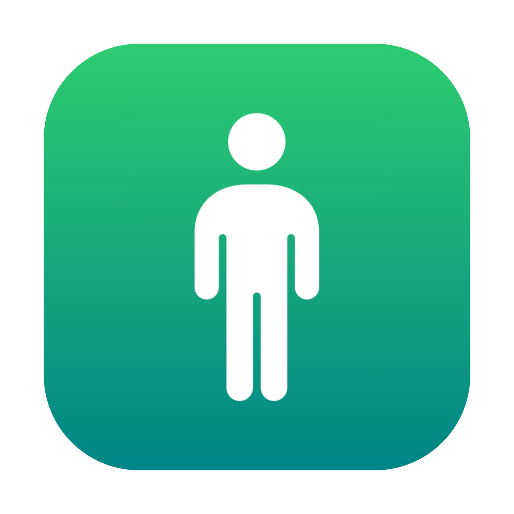

<div align="center">



# PostureFix

**Fix your posture while you work — using the motion sensors in your AirPods.**

[](https://www.apple.com/macos/)
[](https://swift.org)
[](LICENSE)

</div>

PostureFix sits in your menu bar, reads your AirPods' head-motion sensors, and
nudges you the moment your neck starts to slouch toward the screen.

## Install

Homebrew:

```bash
brew install chandansgowda/tap/posture-fix
posture-fix
```

From source (requires macOS 14+ and Xcode):

```bash
git clone https://github.com/chandansgowda/posture-fix.git
cd posture-fix && make run
```

## First run

1. Connect your AirPods (Pro, 3rd gen, Max, or Beats Fit Pro).
2. Click the menu-bar icon → **Start monitoring**, then allow the Motion and
   Notification prompts.
3. Sit up straight, then click **Calibrate**.
4. Slouch and you'll get a nudge.

## Features

- Reads head pitch via Apple's Core Motion — no extra hardware.
- One-tap calibration of your upright baseline.
- Nudges via in-ear sound, an optional spoken cue, and a macOS notification.
- Live stats and a 7-day history chart.
- Tunable sensitivity, hold time, cooldown, and alert sound.
- Start at login. Fully local — nothing leaves your Mac.

## Settings

| Setting | Description |
| --- | --- |
| Sensitivity | How far your head must drop before it counts as slouching |
| Hold before alert | How long you must slouch before being nudged |
| Alert cooldown | Minimum gap between nudges |
| Alert sound | Pick the system sound (with preview) |
| Sound / Spoken / Notification | Toggle each cue on or off |
| Reverse detection | Flip if alerts fire when you sit up instead of slouch |
| Start at login | Launch PostureFix automatically |

## How it works

Modern AirPods expose a 9-axis IMU through `CMHeadphoneMotionManager` — the data
behind Spatial Audio head tracking. PostureFix streams your head pitch, captures
an upright baseline when you calibrate, filters the signal, and flags a slouch
when your head stays dropped past your threshold for a few seconds. There's no
API to buzz AirPods, so the nudge is an in-ear sound/voice cue.

## Compatibility

macOS 14+. AirPods Pro (1st/2nd gen), AirPods (3rd gen), AirPods Max, or
Beats Fit Pro.

## Contributing

PRs welcome — see [CONTRIBUTING.md](CONTRIBUTING.md).

## License

[MIT](LICENSE) © chandansgowda
